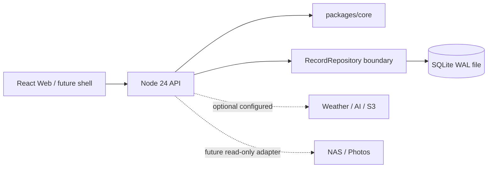

# LifeOS 架构基线

## M1 运行边界

M1 是可自托管的单体应用：React/Vite 负责浏览器界面，Node 24 API 负责认证、校验、时间轴查询和静态文件服务，SQLite 负责真实持久化。开发时 Vite 在 `5173` 代理 `/api` 到 `3001`；生产构建由同一个 Node 进程从 `apps/web/dist` 提供同源静态文件。

默认运行不连接第三方服务；显式配置后可选接入和风天气、DeepSeek 和 S3-compatible 对象存储。NAS/Synology Photos 只读适配、语音、日历同步仍是后续方向。未来 Capacitor/Tauri 可以复用同一 Web/API 分层；本仓库不创建原生 App、离线同步或空壳项目。

## 存储与迁移

`packages/core` 定义 `TimelineRecord`、时间值、原文/编辑正文分层和 `lifeos.export` JSON v1。API 的 `SqliteRecordRepository` 使用 Node 24 的 `node:sqlite` `DatabaseSync` 和参数化 SQL，保留 `RecordRepository` 的职责边界，数据库实现本身不泄漏到 core。M1 选择 SQLite 是为了让单用户实例可以在本机、NAS 和云主机之间直接迁移；未来若需要 PostgreSQL 或其他数据库，只替换 API 适配器并保持 core 模型和导出协议。

记录行保存完整的 core JSON、正文搜索字段、时间轴排序键、revision 和软删除时间。实体与资产引用以 JSON metadata 表保存，因此导入/导出不会静默丢掉 `entities`、`assets`。默认列表和导出排除软删除行，数据库备份仍保留它们。SQLite 文件应放在运行主机本地磁盘或 NAS 本地卷，不能直接放 SMB/NFS 网络共享，也不要与照片原件目录混用。

## 时间轴与一致性

`createdAt` 是录入瞬间，`occurredAt` 是发生时间，任务的 `dueAt` 只是未来计划时间。时间轴按 `occurredAt` 排序，没有发生时间时回退 `createdAt`，不会把 `dueAt` 当作已经发生。带偏移的 instant 会按请求时区显示日计算，date-only 和 unresolved local 保留其日历/墙上时间含义。

POST 只生成新 ID、`createdAt` 和 `body.original`。PATCH 必须携带 revision，正文写入 `body.edited`，更新失败返回 409 并带当前版本；DELETE 使用 revision 做软删除。导入先用 core 完整校验 bundle，再在一个 SQLite 事务内检测所有重复 ID 和写入记录、实体、资产，已有 ID 返回 409，不覆盖已有数据。

## 认证与请求边界

回环绑定可以无密码运行；绑定非回环地址时 `LIFEOS_PASSWORD` 必填。密码模式使用内存会话 token 和 HttpOnly、SameSite=Lax cookie，生产 HTTPS 反向代理可开启 Secure cookie（Compose 的明文 HTTP 默认保持 false，反代后显式设为 true）。无密码模式还校验 Host 必须是 localhost/127.0.0.1/::1，以避免 DNS rebinding 通过伪造 Host 读取本地数据。写请求只接受 JSON，限制 body 大小并检查 Origin；不开放任意 CORS。

## 关联与外部原件

记录与外部世界的关系是显式的：`entityRefs` 指向人物/项目/地点/主题，`relatedRecordIds` 指向其他记录，`assetRefs` 指向照片、音频或附件。API 在写入前会校验被引用对象存在且类型匹配，引用不存在时返回 400；因此数据库里不会留下悬空关联。`entityRefs` 会连同当时的名称一起保存，实体之后被重命名或删除时，时间轴文本仍然可读。

实体和资产各自只有一张 JSON 表，通过 `GET/POST/PATCH/DELETE /api/entities` 和 `/api/assets` 读写。资产刻意只保存 `storageRefs`（`sourceId`、`sourceRef`、可选链接与哈希），不保存原件字节：LifeOS 不把 NAS 照片库复制到服务器。替换 `storageRefs` 时 `assetId` 保持稳定，因此记录不需要跟着改；`RecordRepository` 的边界也因此不必知道底层是本地磁盘、NAS 还是对象存储。

删除实体或资产前会检查仍有多少条活跃记录引用它，被引用时返回 409 而不是级联修改记录。这与软删除记录一样，都是为了不静默丢失用户数据。

正文里的 `@名称` 是关联的书写形式。解析放在 API 的写入路径上，复用 `packages/core` 的 `findEntityMentions`，展示层用同一个函数渲染胶囊，因此不会出现「前端认出来但后端没存」的偏差。两条规则让它足够保守：只认已知的名称或别名；`@` 前一个字符不能是拉丁字母数字。前者排除未知名字（密码里的 `@abc`），后者排除邮箱（`abin@example.com`）。匹配按最长优先，且提及**只增不减**——手工取消的关联不会被文本里的旧提及悄悄加回来，只有再次写入正文才会重新解析。`body.original` 保留用户原样输入的 `@`，胶囊只是展示层的渲染结果。

## 导出与备份

JSON 导出是可校验的 `lifeos.export` v1，Markdown 复用 core 渲染器并将多条记录合并为一个下载文件。照片和音频只导出稳定 asset ID/存储引用，不假装携带 NAS 原件。迁移记录使用 JSON 导入；完整恢复使用停服后复制 SQLite 文件，或 Node 24 `node:sqlite` 的 backup API。运行中的 WAL 文件不能直接盲拷。Docker Compose 提供 `/data` 持久卷和必填密码，但当前环境没有 Docker，尚未在真实 NAS/云容器中验证。
